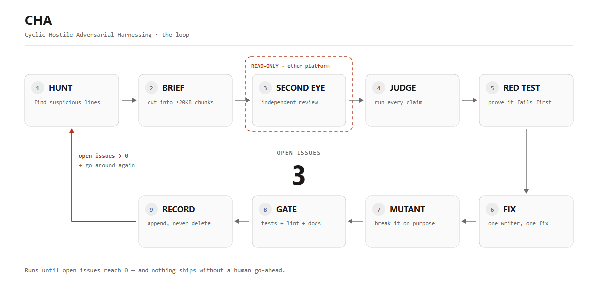
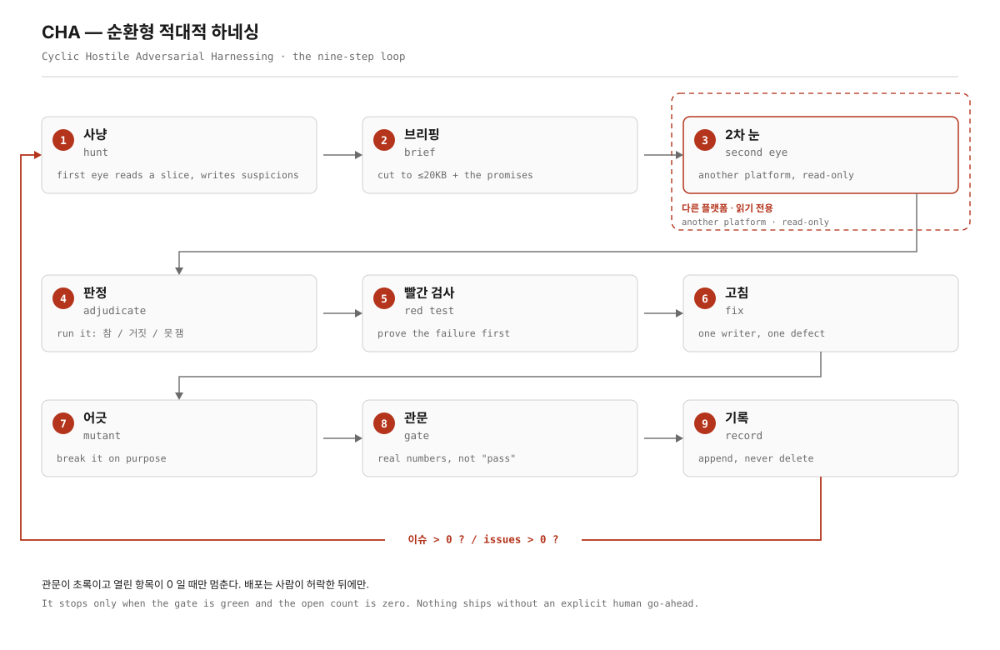
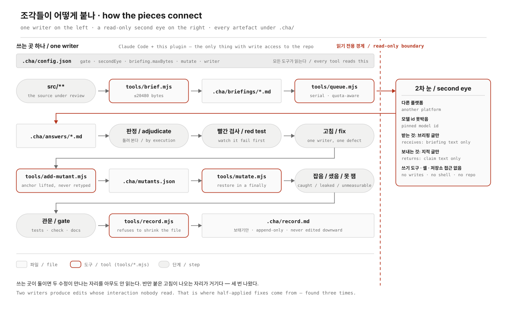
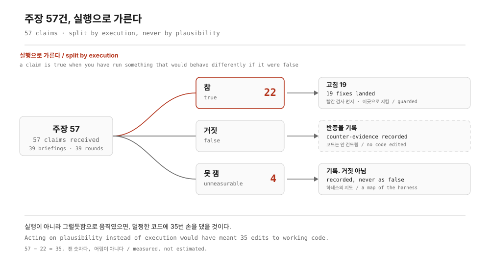

# CHA — Cyclic Hostile Adversarial Harnessing

**한국어 문서: [README.ko.md](README.ko.md)**

A release-gate loop for coding agents. Not a linter, not a prompt pack — a *process* that keeps running until the issue count is zero, and that refuses to believe anything it has not executed.

> The one rule that makes the rest work: **a claim is not a defect until you have run it.**

<picture>
  <source media="(prefers-color-scheme: dark)" srcset="docs/diagrams/loop-anim-dark.gif">
  
</picture>

---

## Why this exists

A coding agent reviewing its own work is the least reliable reviewer you can pick. It wrote the code, it read the same comments, it shares the same blind spots — and when it is unsure, it produces a fluent, confident, wrong answer.

The usual patches don't hold:

| Patch | Why it fails |
|---|---|
| "Review your own diff" | Same model, same context, same blind spot. |
| A second pass from the same model | Correlated errors. It agrees with itself. |
| A stricter linter | Finds shapes, not lies. A comment that contradicts its code is green. |
| More tests | A test that asserts nothing is also green. Nobody notices. |

CHA fixes this by **splitting the roles across platforms and never letting a claim through unexecuted**:

- **A different platform reviews** (Gemini, Codex, GPT — any second eye). Different training, different failure modes, uncorrelated hallucinations.
- **Only one agent writes code** (Claude). Edits stay serialized, so a fix is never half-applied by two writers.
- **Every claim is adjudicated by execution.** In the measured run, **57 claims → 22 true**. Roughly 6 in 10 confident findings were wrong, and reading alone would not have told you which.
- **Every fix is proved red first**, then green.
- **Every fix gets a mutant**: break the fixed line on purpose and confirm a test goes red. If it stays green, the fix is unguarded and someone will delete it.
- **A false warning is a defect.** Code that cries wolf costs the same as code that is silent.

---

## Measured on a real codebase

CHA was not designed on a whiteboard. It was extracted from the release review of `deel` — a zero-dependency Node CLI coding agent.

| | |
|---|---|
| Source under review | **171 files · 77,607 lines** |
| Tests | **154 files · 75,499 lines** |
| Test results at the last gate | **12,596 pass · 0 fail · 1 skip · 156/156 files exit clean** |
| Mutants registered | **1,179** across 138 source files / 119 test files |
| Last full mutation sweep | **1,149 mutants · 2h46m · 1,125 caught · 2 leaked · 22 unmeasurable** — all 24 resolved |
| Gates run | **39** |
| Second-eye briefings in the last round | **39** |
| Claims raised → confirmed by execution | **57 → 22** |
| Fixes landed in that round | **19** |
| Cumulative record | **2,745 lines**, never deleted |
| Commits | **434** |

*Every figure above is the state at **gate 39 (2026-09-16)**. Later rounds move them — this is a snapshot of one measured moment, not a running total. The loop has not stopped.*

**The 24 that the green build was hiding.** The full sweep found 2 mutants that no test caught, and 22 whose anchors had drifted — they were in the list, named, counted as present, and measuring *nothing*. That last category is the dangerous one: it is invisible in both a red run and a green run.

---

## The loop

<picture>
  <source media="(prefers-color-scheme: dark)" srcset="docs/diagrams/loop-dark.svg">
  
</picture>

Nothing ships while the count is above zero, and nothing ships without an explicit human go-ahead.

Step by step, with each one's entry and exit condition: **[docs/en/02-loop.md](docs/en/02-loop.md)**.

---

## How the pieces connect

Everything that can write is on one side of a line: the plugin, the tools, the `.cha/` files, and the single agent that edits code. The second eye is on the other side, on another platform, with a pinned model id and no write tools, no shell, and no repository access. Briefing text crosses one way, claim text crosses back, and nothing else crosses at all.

That line is not about trust. Two writers produce edits whose interaction nobody has read — one moves a guard, the other moves the thing it guarded, both test suites pass separately, and the defect lives in between. Every half-applied fix in the measured rounds had that shape: a header describing behaviour that only one of two call sites implemented. It happened three times.

<picture>
  <source media="(prefers-color-scheme: dark)" srcset="docs/diagrams/architecture-dark.svg">
  
</picture>

---

## Install

```bash
# 1. Add this repo as a plugin marketplace
/plugin marketplace add jysvai/CHA

# 2. Install
/plugin install cha@cha
```

Or point Claude Code at a local clone:

```bash
git clone https://github.com/jysvai/CHA ~/cha
/plugin marketplace add ~/cha
/plugin install cha@cha
```

Then, in the repo you want to review:

```
/cha-init
```

That writes `.cha/` (config, cumulative record, mutant list) and tells you what your second eye needs.

Full setup — including the second-eye CLI, quota handling, and what to do when you have no second platform — is in **[docs/en/01-setup.md](docs/en/01-setup.md)**.

---

## Commands

| Command | What it does |
|---|---|
| `/cha-init` | Scaffold `.cha/` in the current repo and detect the gate commands. |
| `/cha-hunt <path>` | First-eye pass over a slice. Produces suspicions, not verdicts. |
| `/cha-brief <path>` | Cut a file into ≤20KB briefings with the five defect classes attached. |
| `/cha-review2` | Send every pending briefing to the second eye, one at a time, quota-aware. |
| `/cha-judge <tag>` | Adjudicate one answer **by execution**. Writes true/false/unmeasurable with evidence. |
| `/cha-fix <id>` | Red test first, then the fix, then the mutant. Refuses to reorder. |
| `/cha-mutate [filter]` | Run the mutant sweep — all of them, or one file. |
| `/cha-gate` | Run the full gate and refuse to report green on anything unmeasured. |
| `/cha-record` | Append this round to the cumulative record. |
| `/cha-status` | Where the loop is: pending briefings, unjudged answers, unguarded fixes. |

---

## Skills

Skills load automatically when the work matches. You can also invoke them by name.

| Skill | Loaded when |
|---|---|
| `cha-loop` | Running or resuming the loop; deciding what step is next. |
| `cha-briefing` | Cutting source into second-eye briefings. |
| `cha-adjudication` | Judging a claim — the execution-first rules and the verdict format. |
| `cha-mutation` | Writing, repairing, and sweeping mutants. |
| `cha-red-test` | Proving a failure before fixing it. |
| `cha-record` | The cumulative record format and what must never be dropped. |

---

## Agents

| Agent | Role |
|---|---|
| `cha-hunter` | Read-only first eye. Produces suspicions with file:line, never fixes. |
| `cha-adjudicator` | Runs the claim. Returns a verdict with the command and its output. |
| `cha-mutant-smith` | Lifts the exact source line, builds the mutant, verifies it is caught. |

---

## Where the claims went

Every claim is split by execution, not by reading — and the split is not close.

<picture>
  <source media="(prefers-color-scheme: dark)" srcset="docs/diagrams/verdicts-dark.svg">
  
</picture>

---

## The five defect classes

Every briefing carries these. They are the classes that survived every round — the ones a linter cannot see and a same-model review will not name:

1. **A rule that never matches real input.** `/(1b|2b|3b)/` marked `qwen2.5-coder:32b` — a 32B model — as "too small", because `32b` contains `2b`.
2. **Silent failure.** A sheet that could not be read was skipped with `catch { continue; }` and the result still said "read everything".
3. **A test that does not guard.** Named `"rejects non-numeric counts"`, asked only about `'many'`, and let `'3'`, `null`, `true` and `[]` straight through.
4. **Comment contradicts code.** The header said "a line with no `ok` is not counted as a success"; the code counted it as one, and the failure rate came out lower than reality.
5. **Trust-boundary leak.** `--offline` was checked *after* the connection had already knocked on the external address three times, with the key attached.

Details and the real diffs: **[docs/en/09-results.md](docs/en/09-results.md)**.

---

## What CHA refuses to do

- **It does not fix what it could not measure.** Four findings in the last round were platform-locked (Unix-only, or needed Excel installed). They were recorded as *unmeasurable*, not guessed at. Inventing a fix for an unrun claim is the same failure mode CHA exists to stop.
- **It does not let the reviewer write code.** The second eye is read-only. One writer, always.
- **It does not report green on anything it did not run.** An unmeasurable mutant fails the sweep. Silence is not success.
- **It does not ship on its own.** Tag and push happen after a human says so, with the review scope reported first.

---

## Portfolio page

A single self-contained page — the loop, the numbers, the defect classes, and the real before/after:

**[site/index.html](site/index.html)** · open it in a browser, or host it on GitHub Pages.

---

## Documentation

| | |
|---|---|
| [00 — Why](docs/en/00-why.md) | The failure mode this exists to stop. |
| [01 — Setup](docs/en/01-setup.md) | Install, second-eye CLI, quota, no-second-platform fallback. |
| [02 — The loop](docs/en/02-loop.md) | Each step, its entry and exit condition. |
| [03 — Harness tuning](docs/en/03-harness-tuning.md) | What actually had to be tuned, and what broke first. |
| [04 — Briefing](docs/en/04-briefing.md) | Why 20KB, what goes in, what must never go in. |
| [05 — Second eye](docs/en/05-second-eye.md) | Serialization, quota backoff, model pinning, read-only. |
| [06 — Adjudication](docs/en/06-adjudication.md) | Execution-first rules, verdict format, the 57→22 number. |
| [07 — Mutation](docs/en/07-mutation.md) | Anchors, drift, the unmeasurable category. |
| [08 — Gate & record](docs/en/08-gate-and-record.md) | What the gate covers and why the record is never deleted. |
| [09 — Results](docs/en/09-results.md) | The measured run, with the actual defects. |
| [10 — FAQ](docs/en/10-faq.md) | Cost, time, small repos, CI. |

Korean documentation lives in [docs/ko/](docs/ko/).

---

## License

Apache-2.0 — see [LICENSE](LICENSE) and [NOTICE](NOTICE).
